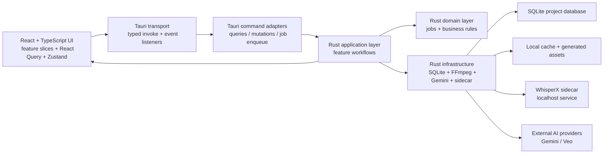

# VibeCut Studio

VibeCut Studio is a local-first desktop video editor built with Tauri, React, TypeScript, Rust, SQLite, FFmpeg, and a local WhisperX sidecar.

The product direction is simple: editing should feel fast and visual, transcripts should be first-class, and AI should behave like an optional assist layer instead of a mandatory cloud backend.

> Status: this is an early-stage project under active architectural refactor. The codebase is already usable for local development, but the API surface, folder structure, and contributor workflow are still being shaped for open source.

## What VibeCut Is Trying To Be

- A desktop-first editor with browser-rendered UI and native media orchestration
- A local-first workspace where clips, transcripts, jobs, and exports live on the machine
- A transcript-aware editing tool for cutting by words, segments, pauses, and intent
- A foundation for AI-assisted editing that does not block local editing when no API key is configured
- A codebase that can grow feature-by-feature without forcing every contributor into the same monolithic files

## What Works Today

- Tauri desktop shell with a React editor surface
- Media import through file picker or drag-and-drop
- Local media library with previews, metadata, and waveform placeholders
- Source/program monitor workflow
- Timeline editing with frontend undo/redo state
- Transcript panel with segment and pause driven editing flows
- Local WhisperX sidecar for transcription and word alignment
- Durable local job records for transcription, AI edit, and export
- SQLite-backed project state and normalized transcript storage
- Targeted desktop events for job updates and entity invalidation
- Optional Gemini-backed AI features for edit intent, image generation, video generation, and font suggestions
- FFmpeg-based export pipeline

## Current Reality And Limitations

This section is intentionally candid so the repo is easy to evaluate as open source.

- The desktop Tauri app is the primary runtime. `npm run dev:web` is useful for UI iteration, but desktop-only features are unavailable there.
- The sidecar boot script is Unix-oriented today because it uses `bash` and a Unix virtualenv path. macOS and Linux are the best-supported contributor paths right now.
- Search in the current UI is transcript text search. Embedding infrastructure exists, but full semantic search is still a roadmap item.
- Some legacy compatibility files still exist so older panels keep working while the feature-slice migration continues.
- Automated tests are planned but not yet the main quality gate. Current checks are build, lint, and Rust compile verification.
- There is no `LICENSE` file in the repository yet. Until one is added, the repo is not fully open-source-ready from a legal standpoint.

## Architecture Overview

VibeCut is split into three main runtimes:

1. React frontend for the editor UX
2. Rust/Tauri backend for orchestration, persistence, jobs, and native integrations
3. Python WhisperX sidecar for local transcription and alignment



### Frontend Architecture

The frontend is now feature-first instead of page-first.

- `src/app/editor/EditorShell.tsx` is the main composition root
- `src/app/providers` wires global providers such as React Query
- `src/features/*` owns end-to-end feature slices
- `src/shared/*` contains true cross-feature building blocks
- `src/components/*` still contains some legacy UI pieces that are being consumed through the new shell

State ownership is intentionally split:

- React Query owns async desktop data and mutations
- Zustand owns local UI/session/playback state
- Timeline edits are optimistic in the frontend and persisted through typed patch mutations

### Backend Architecture

The Tauri backend is now layered to reduce hotspot files and make parallel work safer:

- `src-tauri/src/tauri_commands` contains thin command adapters only
- `src-tauri/src/application` contains feature workflows and event emission
- `src-tauri/src/domain` contains core business rules such as the job state machine
- `src-tauri/src/infrastructure` contains provider integrations and runtime helpers
- `src-tauri/src/db.rs` owns persistence and schema management

The old `commands.rs` and `ai.rs` files remain as compatibility facades, but the important logic now lives below them.

### Event Model

The desktop runtime emits two important event channels:

- `jobs.updated`
- `entities.changed`

These are used by the frontend to update React Query caches and invalidate only the feature data that changed.

### Durable Job System

Long-running work is moving to a shared local job model so future features follow one execution pattern.

Current job-backed workflows include:

- transcription
- AI edit intent
- export

Each job is stored locally with status, progress, timestamps, payload, and result metadata.

## Core Domain Entities

The current contracts revolve around a small set of shared entities:

- `ProjectSummary` and `ProjectSnapshot`
- `MediaAsset`
- `SequenceItem`
- `TranscriptSegment`
- `TranscriptWord`
- `PauseRange`
- `JobRecord`

On the Rust side, these DTOs are defined in `src-tauri/src/models.rs` and mirrored in TypeScript under `src/shared/contracts`.

## Repository Layout

```text
.
├── src
│   ├── app
│   │   ├── editor
│   │   └── providers
│   ├── components
│   ├── features
│   │   ├── ai
│   │   ├── export
│   │   ├── jobs
│   │   ├── library
│   │   ├── playback
│   │   ├── project
│   │   ├── registry
│   │   ├── session
│   │   ├── timeline
│   │   └── transcript
│   ├── shared
│   │   ├── contracts
│   │   ├── desktop
│   │   ├── query
│   │   └── utils
│   └── types
├── src-tauri
│   ├── src
│   │   ├── application
│   │   ├── domain
│   │   ├── infrastructure
│   │   ├── tauri_commands
│   │   ├── ai.rs
│   │   ├── commands.rs
│   │   ├── db.rs
│   │   ├── main.rs
│   │   ├── models.rs
│   │   └── state.rs
│   └── tauri.conf.json
├── sidecar
│   ├── README.md
│   ├── requirements.txt
│   └── server.py
└── scripts
    └── run-sidecar.sh
```

## Data And Storage Model

VibeCut is local-first. There is no required hosted application backend for core editing flows.

The Tauri app stores state in a local SQLite database and cache directory under the OS app data location.

Key persistence areas today:

- `media_assets`
- `sequence_items`
- `jobs`
- `transcript_segments`
- `transcript_words`
- `pause_ranges`

This means:

- project state survives app restarts
- long-running jobs can be tracked durably
- transcript data no longer has to live only inside one coarse JSON blob

## Command Surface

The new command model is intentionally split by responsibility.

### Queries

- `project_get`
- `library_list`
- `timeline_get`
- `transcript_get`
- `jobs_list`
- `capabilities_get`

### Fast Mutations

- `library_import_paths`
- `timeline_apply_patch`

### Async Enqueues

- `transcript_enqueue`
- `ai_enqueue_edit_command`
- `export_enqueue`

This command split is important for maintainability and for future contributors: read operations, immediate writes, and async workflows are treated as different categories on purpose.

## Tech Stack

- Frontend: React 19, TypeScript, Vite
- Frontend state: TanStack Query, Zustand
- Desktop shell: Tauri 2
- Backend language: Rust
- Persistence: SQLite via `rusqlite`
- Media tooling: FFmpeg and FFprobe
- Local transcription: Python FastAPI + WhisperX sidecar
- Optional AI provider: Gemini / Veo via `reqwest`

## Getting Started

### Prerequisites

Install these before running the desktop app locally:

- Node.js
- npm
- Rust toolchain and Cargo
- `ffmpeg`
- `ffprobe`
- Python 3 with `venv` support
- Bash-compatible shell for the current sidecar helper script

### 1. Install Dependencies

```bash
npm install
```

### 2. Configure Environment

Copy the example environment file:

```bash
cp .env.example .env.local
```

At minimum, AI-backed features require:

```bash
GEMINI_API_KEY=your_key_here
```

If you do not set `GEMINI_API_KEY`, local editing and local transcription still work, but AI-backed generation and edit intent features will be unavailable.

### 3. Start The Desktop App

```bash
npm run dev:desktop
```

This starts:

- the Tauri desktop app
- the local transcription sidecar

On first run, the sidecar helper creates `.venv-sidecar` and installs any missing Python dependencies from `sidecar/requirements.txt`.

### Alternative Workflows

Run just the desktop app:

```bash
npm run dev:tauri
```

Run just the sidecar:

```bash
npm run dev:sidecar
```

Run a browser-only UI preview:

```bash
npm run dev:web
```

Run the browser preview with the sidecar:

```bash
npm run dev:local
```

## Environment Variables

The current `.env.example` includes:

| Variable | Purpose |
| --- | --- |
| `TRANSCRIPTION_PROVIDER` | Selects the transcription backend. Current default is local. |
| `LOCAL_ALIGNER_URL` | Base URL for the WhisperX sidecar. |
| `WHISPERX_MODEL` | WhisperX model name used by the sidecar. |
| `WHISPERX_DEVICE` | Device hint for WhisperX, such as `cpu`. |
| `GEMINI_API_KEY` | Enables Gemini-backed AI features. |

## Useful Commands

```bash
npm run dev:desktop
npm run dev:web
npm run dev:local
npm run dev:sidecar
npm run sidecar:install
npm run sidecar:health
npm run build
npm run lint -- .
cd src-tauri && cargo check
npm run tauri:build
```

## Development Workflow

### Recommended Flow

1. Run `npm run dev:desktop`
2. Import one or more local video files
3. Let transcription create transcript and pause data
4. Edit on the timeline and through the transcript panel
5. Trigger an export job

### Browser Preview Notes

The browser preview is useful for layout and interaction work, but it uses a limited non-Tauri path for some queries. Use the Tauri app whenever you are touching:

- native dialogs
- file path handling
- desktop events
- SQLite-backed flows
- FFmpeg export
- AI provider calls

## Contributor Guide

This repo is being prepared for open source, so architecture discipline matters.

### Frontend Rules

- Add new product areas under `src/features/<feature-name>`
- Keep async loading and mutations in feature-local APIs backed by React Query
- Keep local UI state in feature or session Zustand stores
- Do not add new business logic to `DesktopEditor.tsx`
- Prefer registry-based composition over hardcoded shell switches
- Put only genuinely shared code in `src/shared`

### Backend Rules

- Add new commands in `src-tauri/src/tauri_commands`
- Put use-case logic in `src-tauri/src/application`
- Put cross-cutting business rules in `src-tauri/src/domain`
- Put provider and runtime integrations in `src-tauri/src/infrastructure`
- Keep `commands.rs` and `ai.rs` thin

### Async Feature Rules

If a workflow is slow, retryable, or status-bearing, model it as a job instead of an inline command.

That usually means:

1. create or reuse a `JobRecord`
2. persist it in SQLite
3. emit `jobs.updated`
4. emit `entities.changed` when the affected data becomes stale or ready
5. update the relevant React Query cache on the frontend

### Contracts

Rust is the current source of truth for desktop DTOs. When changing a shared entity:

- update `src-tauri/src/models.rs`
- update the matching TypeScript types in `src/shared/contracts`
- keep the serialized field names aligned

### Parallel Work Strategy

The repo is intentionally moving toward slice-based ownership so multiple contributors or agents can work in parallel without constant merge conflicts.

Good parallelization boundaries:

- `library`
- `timeline`
- `transcript`
- `playback`
- `ai`
- `export`
- `jobs`
- provider integrations
- persistence and schema evolution

Bad places to re-centralize logic:

- `src/components/DesktopEditor.tsx`
- `src-tauri/src/commands.rs`
- `src-tauri/src/ai.rs`

## Quality Checks

Current verification commands:

- `npm run build`
- `npm run lint -- .`
- `cd src-tauri && cargo check`

The project does not yet have a mature automated unit/integration/e2e test suite. That is one of the main open-source readiness gaps.

## Roadmap

Planned or in-progress areas include:

- stronger test coverage across frontend, backend, and migration paths
- fuller semantic search powered by embeddings
- broader provider abstractions for AI and transcription
- cleaner migration away from remaining compatibility shims
- better cross-platform support, especially Windows contributor ergonomics
- improved open-source readiness docs such as `CONTRIBUTING`, `CODE_OF_CONDUCT`, and `SECURITY`

## Privacy And Data Flow

The default architecture is local-first:

- project data is stored locally
- transcripts are generated locally through the sidecar when using the local provider
- FFmpeg work runs locally

If AI features are enabled with `GEMINI_API_KEY`, prompts and any related request payloads are sent to the configured provider. Contributors and users should treat those flows as opt-in cloud integrations.

## Open Source Readiness Notes

If you plan to publish the repository soon, the highest-value follow-up files to add are:

- `LICENSE`
- `CONTRIBUTING.md`
- `CODE_OF_CONDUCT.md`
- `SECURITY.md`
- issue and pull request templates

The README now reflects the current architecture, but those repo-level governance files are the next step for making the project comfortable for outside contributors.

## License

No license file is present yet.

If you intend to open source VibeCut Studio, add a license before accepting public contributions. Until then, the default legal status is effectively all rights reserved.
